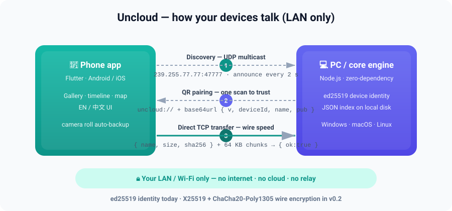

<div align="center">

# Uncloud

**No cloud. No account. No server.**

A local-first photo & file manager that syncs your phone ↔ PC directly over your own Wi-Fi.

[](LICENSE)
[](https://github.com/yniantongtian-oss/uncloud/actions/workflows/ci.yml)
[](CONTRIBUTING.md)
[](https://github.com/yniantongtian-oss/uncloud/stargazers)

**[English](README.md) · [简体中文](README.zh-CN.md) · [Documentation](docs/)**

</div>

<p align="center">
  
</p>

---

## Why Uncloud?

Your photos are the most personal data you own — and today every "easy" option asks for something in return:

- **Cloud photos leak, and the subscription never ends.** Your memories sit on someone else's computer, mined by default and one breach away from strangers — all for a monthly fee that grows with your library.
- **immich & PhotoPrism are excellent — if you run a server.** Docker, a NAS, TLS certs, backups of the server itself… most people don't want a homelab. They just want their photos on their own PC.
- **Syncthing moves bytes, not memories.** Rock-solid sync, but there's no timeline, no map, no gallery — just folders of files.
- **LocalSend is a one-shot courier.** Perfect for "send this file right now", but it won't back up your camera roll or organize anything.

**Uncloud in 90 seconds:** install the app on your phone and your PC, scan one QR code to pair them, and your camera roll starts flowing to your computer over your own Wi-Fi — browse it as a timeline, on a map, or as plain folders. No sign-up. No Docker. No relay. No third party ever touches a single byte.

## Features

- 📸 **Auto photo backup** — new shots land on your PC whenever both devices are on the same network.
- 🔀 **Phone ↔ PC direct transfer** — any file, any size, raw TCP over LAN at wire speed.
- 🖼 **Timeline & map views** — a real gallery experience, not a folder tree.
- 🤖 **Local AI** — on-device dedupe & face grouping *(coming soon)*. Nothing is uploaded for "intelligence".
- 🔐 **End-to-end encrypted** — ed25519 device identity today; X25519 + ChaCha20-Poly1305 wire encryption lands in v0.2.
- 🌐 **EN / 中文 UI** — English by default, one-tap switch to Simplified Chinese.

## How it compares

|                          | Uncloud | immich | PhotoPrism | Syncthing | LocalSend | Google Photos |
| ------------------------ | :-----: | :----: | :--------: | :-------: | :-------: | :-----------: |
| No server needed         |   ✅    |   ❌¹   |     ❌     |    ✅     |    ✅     |      ❌       |
| No account required      |   ✅    |   ✅   |     ✅     |    ✅     |    ✅     |      ❌       |
| Gallery UX (timeline/map)|   ✅    |   ✅   |     ✅     |    ❌     |    ❌     |      ✅       |
| General file manager     |   ✅    |   ❌   |     ❌     |    ✅     |    ✅     |      ❌       |
| End-to-end encrypted     |   ✅²   |   ❌³   |     ❌     |    ✅     |    ✅     |      ❌       |
| 100% free                |   ✅    |   ✅   |     ✅     |    ✅     |    ✅     |      ❌       |

¹ immich requires a self-hosted server (Docker). ² Wire encryption ships in v0.2; device identity and SHA-256 integrity verification are in place today. ³ immich encrypts traffic in transit only if you configure TLS / a reverse proxy yourself.

Full, honest breakdown — including where each alternative is genuinely better: **[docs/comparison.md](docs/comparison.md)**.

## Quickstart

### Core engine — zero-dependency Node.js (≥ 20)

No `npm install`. No build step. No dependencies at all.

```bash
git clone https://github.com/yniantongtian-oss/uncloud.git
cd uncloud/core

# See the whole protocol — identity, discovery, pairing, transfer — in one shot
node bin/uncloud.js demo

# Show (or create on first run) this device's ed25519 identity
node bin/uncloud.js id

# Watch other Uncloud devices announce themselves on the LAN
node bin/uncloud.js scan

# Run a receiver for incoming files
node bin/uncloud.js serve

# Send a file to a paired device
node bin/uncloud.js send path/to/photo.jpg --to 192.168.1.42:47778

# Print the QR pairing payload for this device
node bin/uncloud.js pair
```

### App — Flutter (Android · iOS · Windows · macOS · Linux)

```bash
cd app
flutter pub get
flutter run          # pick a device: phone, desktop, or emulator
```

Release builds, e.g. Android: `flutter build apk --release`. Requires the Flutter stable channel.

## Architecture

```
┌──────────────┐                                        ┌──────────────┐
│  Phone app   │  ① UDP multicast 239.255.77.77:47777   │   PC app /   │
│  (Flutter)   │ ─ ─ ─ announce every 2 s ─ ─ ─ ─ ─ ─ ▶ │  core engine │
│              │                                        │ (Node.js,    │
│  gallery UI  │  ② QR pairing: uncloud:// + base64url  │  zero-dep)   │
│  EN / 中文   │ ◀ ─ ─ ─ {v, deviceId, name, pub…} ─ ─  │              │
│              │                                        │  ed25519 id  │
│              │  ③ TCP transfer                        │  JSON index  │
│              │ ════ {name,size,sha256}\n + 64 KB ═══▶ │  on disk     │
│              │ ◀ ════ {ok:true} after sha256 ════════ │              │
└──────────────┘                                        └──────────────┘
        ▲────────────────── your LAN / Wi-Fi only ──────────────────▲
        └──────────── no internet · no cloud · no relay ────────────┘
```

Details: **[docs/architecture.md](docs/architecture.md)** · wire spec: **[docs/protocol.md](docs/protocol.md)**

## Repository layout

```
uncloud/
├── core/       # zero-dependency Node.js engine & CLI (id/scan/pair/serve/send/demo)
├── app/        # Flutter app (Android, iOS, Windows, macOS, Linux)
├── docs/       # architecture, protocol, comparison, roadmap
└── .github/    # CI, issue forms, PR template
```

## Roadmap

| Version | Milestone |
| ------- | --------- |
| **v0.1** | Core CLI + app demo: identity, discovery, pairing, transfer, JSON index |
| **v0.2** | E2E encryption (X25519 + ChaCha20-Poly1305), automatic photo backup |
| **v0.3** | Local AI dedupe & search, map view, SQLite index |
| **v1.0** | iOS release, app-store distribution |

Full checklist: **[docs/roadmap.md](docs/roadmap.md)**

## Contributing

Contributions are very welcome — from protocol reviews to translations. Start with **[CONTRIBUTING.md](CONTRIBUTING.md)**, look for issues labeled `good first issue`, and please follow our **[Code of Conduct](CODE_OF_CONDUCT.md)**.

## License

[Apache-2.0](LICENSE) © yniantongtian-oss. Your data never leaves your devices — and neither does this code's openness.
