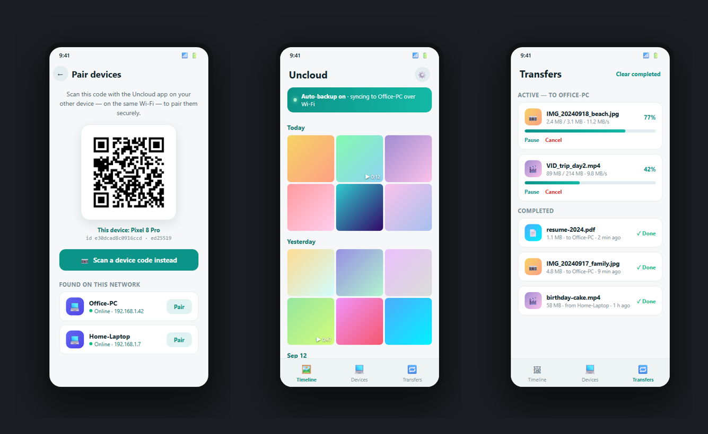

<div align="center">

# Uncloud

**无云端、无账号、无服务器。**

本地优先的照片与文件管理器，让手机和电脑通过你自己的 Wi-Fi 直接互传同步。

[](LICENSE)
[](https://github.com/yniantongtian-oss/uncloud/actions/workflows/ci.yml)
[](CONTRIBUTING.md)
[](https://github.com/yniantongtian-oss/uncloud/stargazers)

**[English](README.md) · [简体中文](README.zh-CN.md) · [文档](docs/)**

</div>

<p align="center">
  
</p>

---

## 为什么做 Uncloud？

照片是你最私密的数据，但如今每一个"省心"的方案都要你付出代价：

- **云端相册会泄露，订阅费还永远交不完。** 你的回忆存在别人的服务器上，默认被算法分析，离陌生人的距离只差一次数据泄露——而且月费随着你的照片库一起涨。
- **immich 和 PhotoPrism 很优秀——前提是你有一台服务器。** Docker、NAS、TLS 证书、还要给服务器本身做备份……大多数人并不想折腾家庭实验室，只想让照片安安稳稳躺在自己的电脑上。
- **Syncthing 搬运的是字节，不是回忆。** 同步本身坚如磐石，但没有时间线、没有地图、没有相册——只有一堆文件夹。
- **LocalSend 是一次性快递员。** "现在把这个文件发过去"它做得很好，但它不会自动备份你的相册，也不会帮你整理任何东西。

**90 秒了解 Uncloud：** 在手机和电脑上各装一个 App，扫一次二维码完成配对，相册就会通过你自己的 Wi-Fi 自动流向电脑——可以按时间线浏览、在地图上查看，或者就当普通文件夹来用。无需注册、无需 Docker、无需中转服务器，任何第三方都碰不到你的一个字节。

## 功能特性

- 🔀 **手机 ↔ 电脑直连传输** —— 任意文件、任意大小，局域网 TCP，SHA-256 校验。
- 🔐 **设备身份** —— 今天是 ed25519；线路加密（X25519 + ChaCha20-Poly1305）在 v0.2。
- 🌐 **EN / 中文界面** —— 默认英文，一键切换简体中文。
- 🖼 **时间线界面** —— v0.1 已有图库壳；地图视图在 v0.3。
- 📸 **照片自动备份** —— *v0.2*。v0.1 已能配对并单次发送。
- 🤖 **本地 AI** —— 端侧去重与人脸分组（v0.3）。所谓"智能"，绝不上传任何东西。

## 与同类方案对比

|                      | Uncloud | immich | PhotoPrism | Syncthing | LocalSend | Google Photos |
| -------------------- | :-----: | :----: | :--------: | :-------: | :-------: | :-----------: |
| 无需服务器           |   ✅    |  ❌¹   |     ❌     |    ✅     |    ✅     |      ❌       |
| 无需账号             |   ✅    |   ✅   |     ✅     |    ✅     |    ✅     |      ❌       |
| 相册体验（时间线/地图）|   ✅    |   ✅   |     ✅     |    ❌     |    ❌     |      ✅       |
| 通用文件管理         |   ✅    |   ❌   |     ❌     |    ✅     |    ✅     |      ❌       |
| 端到端加密           |   ✅²   |  ❌³   |     ❌     |    ✅     |    ✅     |      ❌       |
| 完全免费             |   ✅    |   ✅   |     ✅     |    ✅     |    ✅     |      ❌       |

¹ immich 需要自建服务器（Docker）。² 传输加密在 v0.2 提供；设备身份与 SHA-256 完整性校验现已就绪。³ immich 只有在你自行配置 TLS / 反向代理后才有传输加密。

更详细、更诚实的对比——包括每个替代方案真正更强的地方：见 **[docs/comparison.md](docs/comparison.md)**。

## 快速上手

### 核心引擎 —— 零依赖 Node.js（≥ 20）

不需要 `npm install`，没有构建步骤，一个依赖都没有。

```bash
git clone https://github.com/yniantongtian-oss/uncloud.git
cd uncloud/core

# 一条命令看完整套协议：身份、发现、配对、传输
node bin/uncloud.js demo

# 查看（首次运行时创建）本设备的 ed25519 身份
node bin/uncloud.js id

# 观察局域网内其他 Uncloud 设备的广播
node bin/uncloud.js scan

# 启动接收端，等待接收文件
node bin/uncloud.js serve

# 向已配对的设备发送文件
node bin/uncloud.js send path/to/photo.jpg --to 192.168.1.42:47778

# 打印本设备的二维码配对信息
node bin/uncloud.js pair
```

### 应用 —— Flutter（Android · iOS · Windows · macOS · Linux）

```bash
cd app
flutter pub get
flutter run          # 选择设备：手机、桌面或模拟器
```

发布构建（以 Android 为例）：`flutter build apk --release`。需要 Flutter stable 通道。

## 架构

```
┌──────────────┐                                        ┌──────────────┐
│   手机 App   │  ① UDP 组播 239.255.77.77:47777        │  电脑 App /  │
│  (Flutter)   │ ─ ─ ─ 每 2 秒广播一次 ─ ─ ─ ─ ─ ─ ─ ▶  │   核心引擎   │
│              │                                        │ (Node.js,    │
│   相册界面   │  ② 扫码配对：uncloud:// + base64url     │   零依赖)    │
│  EN / 中文   │ ◀ ─ ─ ─ {v, deviceId, name, pub…} ─ ─  │              │
│              │                                        │  ed25519 身份│
│              │  ③ TCP 传输                            │  JSON 索引   │
│              │ ════ {name,size,sha256}\n + 64KB ════▶ │  存于本地磁盘│
│              │ ◀ ════ 校验 sha256 后回复 {ok:true} ══ │              │
└──────────────┘                                        └──────────────┘
        ▲────────────────── 仅限你的局域网 / Wi-Fi ─────────────────▲
        └────────────── 不联网 · 不上云 · 无中转 ───────────────────┘
```

详见：**[docs/architecture.md](docs/architecture.md)** · 协议规范：**[docs/protocol.md](docs/protocol.md)**

## 仓库结构

```
uncloud/
├── core/       # 零依赖 Node.js 引擎与 CLI（id/scan/pair/serve/send/demo）
├── app/        # Flutter 应用（Android、iOS、Windows、macOS、Linux）
├── docs/       # 架构、协议、对比、路线图
└── .github/    # CI、Issue 表单、PR 模板
```

## 路线图

| 版本 | 里程碑 |
| ---- | ------ |
| **v0.1** | 核心 CLI + 应用演示：身份、发现、配对、传输、JSON 索引 |
| **v0.2** | 端到端加密（X25519 + ChaCha20-Poly1305）、照片自动备份 |
| **v0.3** | 本地 AI 去重与搜索、地图视图、SQLite 索引 |
| **v1.0** | iOS 发布、应用商店上架 |

完整清单：**[docs/roadmap.md](docs/roadmap.md)**

## 参与贡献

热烈欢迎各种形式的贡献——从协议评审到界面翻译。请先阅读 **[CONTRIBUTING.md](CONTRIBUTING.md)**，从标记 `good first issue` 的议题入手，并请遵守我们的**[行为准则](CODE_OF_CONDUCT.md)**。

## 许可证

[Apache-2.0](LICENSE) © yniantongtian-oss。你的数据永不离开你的设备——这份代码的开放性也一样。
